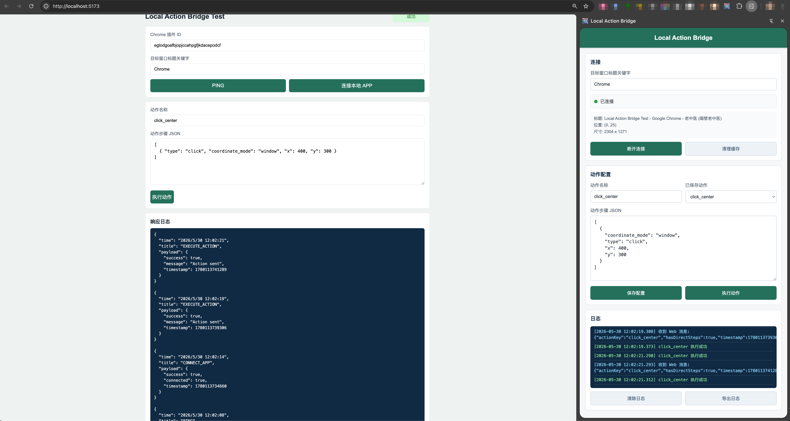

# Local Action Bridge

这是一个通用的 Chrome 扩展 + Native Messaging 本地程序，用于让网页通过插件中转，触发本地 APP 的鼠标和键盘操作。

## 演示



[查看操作演示视频](<image/Screen Recording 2026-05-30 at 12.04.46.mov>)

## 消息链路

网页发送消息给 Chrome 扩展，扩展通过 Native Messaging 连接 Python 本地程序，Python 使用 `pyautogui` 执行动作。

支持的外部消息：

- `PING`：检查插件可达性。
- `CONNECT_APP`：连接本地程序并按窗口标题关键字定位目标 APP。
- `EXECUTE_ACTION`：执行动作序列。

## 安装

1. Chrome 打开扩展管理页，选择 `Load unpacked`，加载 `chrome-extension` 目录。
2. 记录插件 ID。
3. 修改 `local-action-bridge-client/com.localaction.bridge.json`：
   - `path` 改成你本机编译后的可执行文件路径。
   - `allowed_origins` 改成你的插件 ID，格式为 `chrome-extension://<插件ID>/`。
4. 复制 native host 配置：

```bash
cp local-action-bridge-client/com.localaction.bridge.json ~/Library/Application\ Support/Google/Chrome/NativeMessagingHosts/
```

5. 在 macOS `System Settings -> Privacy & Security -> Accessibility` 给本地可执行程序授权。

## 动作步骤格式

动作步骤是 JSON 数组：

```json
[
  { "type": "click", "coordinate_mode": "window", "x": 400, "y": 300 },
  { "type": "wait", "duration_ms": 200 },
  { "type": "hotkey", "keys": ["command", "a"] },
  { "type": "write", "text": "hello" },
  { "type": "press", "key": "enter" }
]
```

`coordinate_mode` 支持：

- `screen`：屏幕绝对坐标。
- `window`：目标窗口左上角相对坐标。

## 微 Web 测试页

本地启动静态服务：

```bash
cd web-test
python3 -m http.server 5173
```

浏览器打开 `http://localhost:5173`，填写插件 ID、目标窗口标题关键字和动作步骤，然后依次测试 `PING`、`CONNECT_APP`、`EXECUTE_ACTION`。

## 日志

```bash
tail -f /tmp/local_action_bridge_logs/native_messaging_detailed.log
```

## 构建本地程序

```bash
cd local-action-bridge-client
pyinstaller --name local-action-bridge main.py -y
```

## License

MIT
